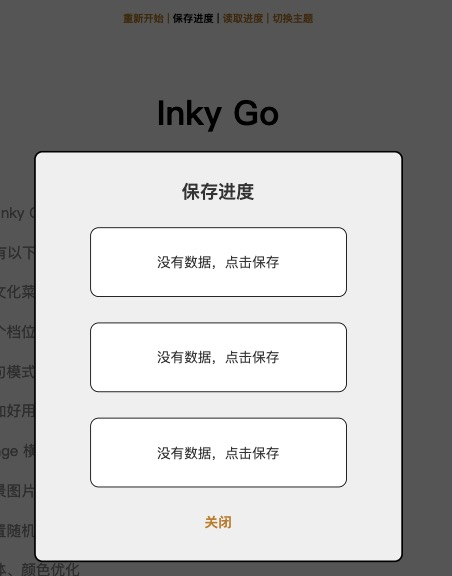

# InkyGo

优化与扩展 Inky 模版

当前对应 Inky 版本：[0.14.1](https://github.com/inkle/inky/releases/tag/0.14.1)

sample: [猛击此处](https://ahayoo.com/inky-go/)

## 功能列表

| 功能 | 说明 |
| --- | --- |
| 中文菜单 |  |
| 多个存档位置 |  |
| 单句模式 | 没有选项时，不是所有文字一起出现，而是点击一次出一句话   |
| 自动样式 | 根据角色名，自动套用样式  |
| 图片改进 | 可以控制文中嵌入的图片大小、可以设置背景图片 | 
| 音乐音效改进 | 更加好用的方式，控制背景音乐、音效的播放、循环、停止 |
| 随机数改进 | 可以设置随机数动态 seed，避免读档后随机数仍然相同 |
| 其他调整 | 修复滚动问题、文字样式优化等 |

## 使用方法

安装方法与全功能说明：[Inky Go 文档](docs/index.md)

- - - - - 

若是觉得不错，请我喝一杯咖啡吧