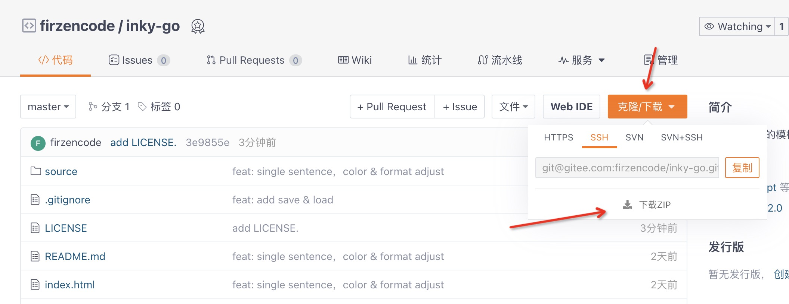
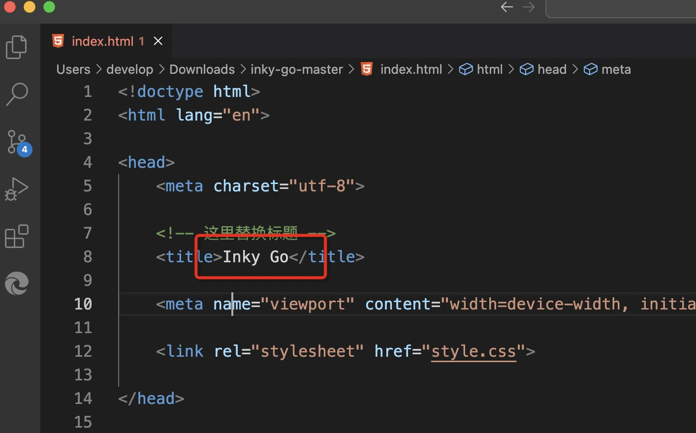
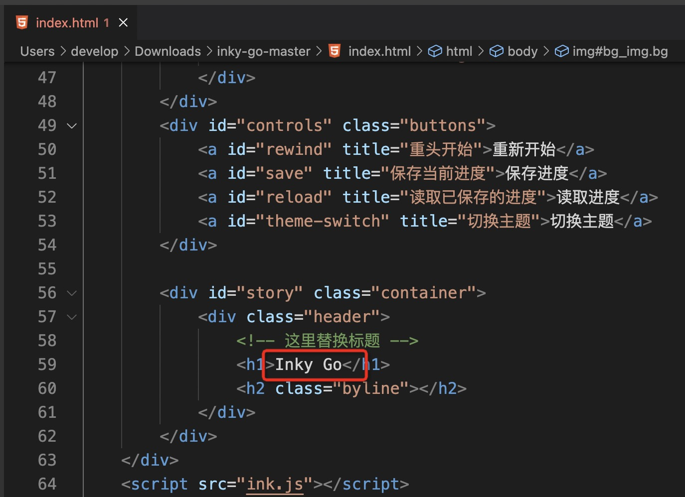
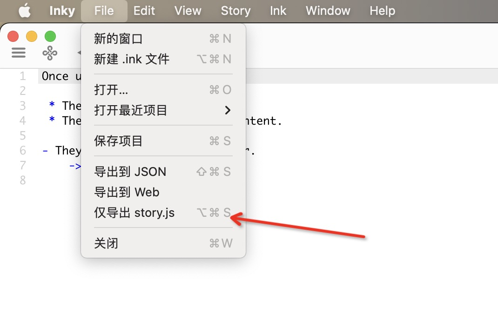
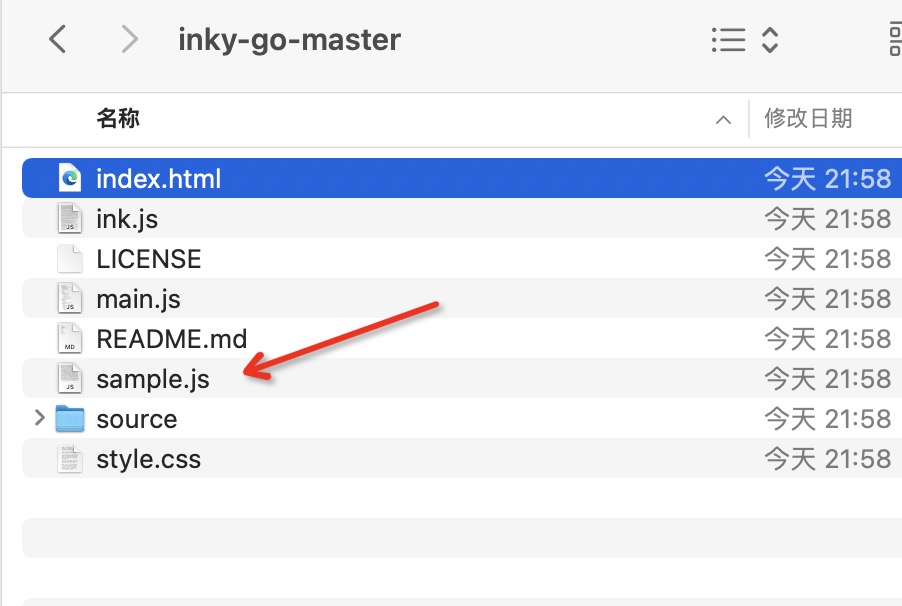
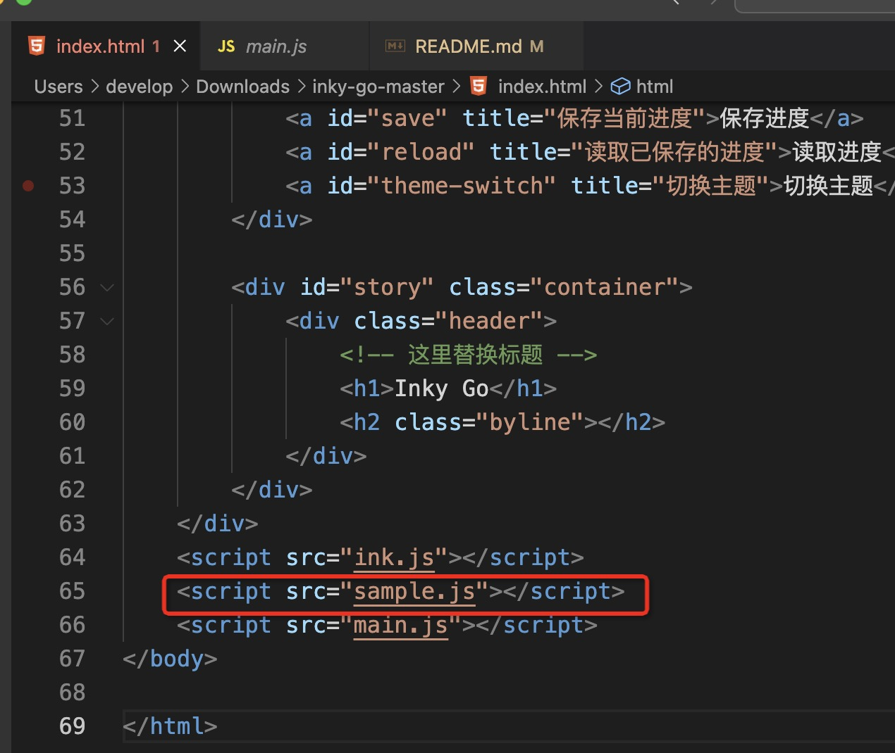
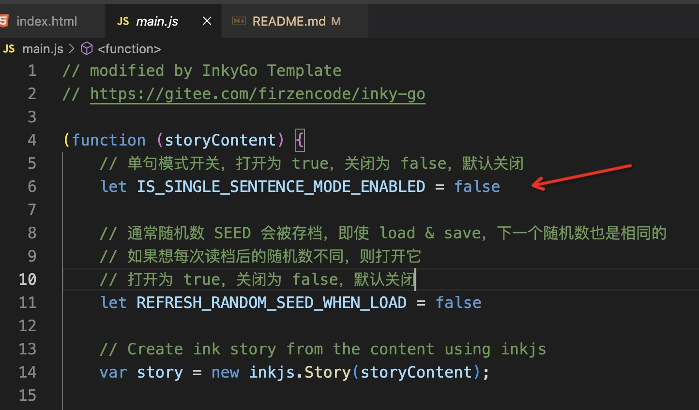
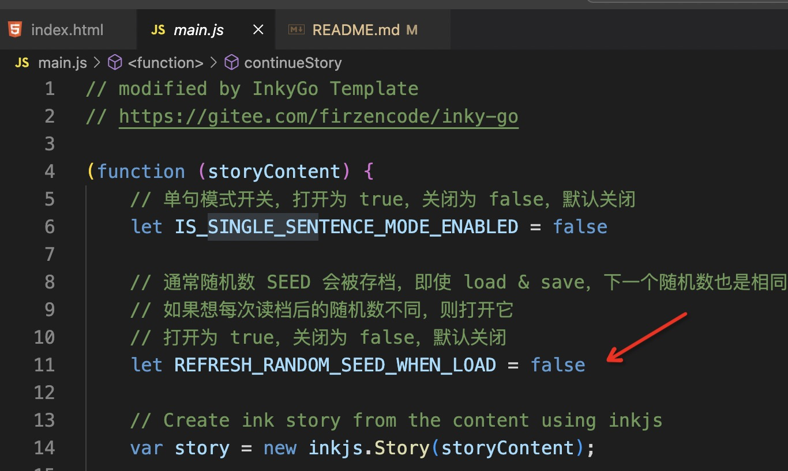

# InkyGo

优化与扩展 Inky 模版

sample: [猛击此处](https://ahayoo.com/inky-go/)

## 功能列表
- [x] 中文化菜单
- [x] 多个档位，存档读档
- [x] 单句模式
- [x] 更加好用的 BGM / SE 控制
- [x] Image 横向可以控制大小
- [x] 背景图片显示 / 隐藏
- [x] 重置随机数
- [x] 字体、颜色优化
- [ ] 背景图片显示过渡效果
- [ ] 修复 Inky 偶尔无法自动滚动到底部的问题
- [ ] 背景与文字的进一步融合

## 使用方式

1. 下载项目
    
    点击右上角的克隆/下载 -> 下载 ZIP，然后解压缩到任意目录
    <br>
2. 修改 index.html
    
    
    修改 index.html 中上述位置，替换标题
    <br>
3. 导出 Inky 数据
    
    
    在 Inky 中选择仅导出 story.js，替换原本的 sample.js
    <br>
4. 点击 index.html 运行项目
    <br>
5. 备注：
    如果在 Inky 中修改了内容，只需要重复执行第 3 步，导出 story.js 即可
    <br>
6. 备注 2：
    如果不喜欢 sample.js 这个名字，执行第 3 步时，可以导出任意文件名，然后修改 index.html 中的如下位置
    
    <br>
7. 备注 3：
    项目中的 images、sources 文件夹都是不需要的，可以直接删除

## 使用说明

以下是对扩展功能的使用介绍，诸如中文化/样式优化等功能，不再此处赘述。

### TAG 说明

Inky 中使用以下格式，

```
# 名称: 内容
```

可以创建一个 TAG。大部分扩展功能，会基于上述 TAG 格式。
当故事运行到 TAG 的位置时，会执行对应的功能。

注意，如果TAG 内容是一个类似 https://www.xxxxx.com/xxxx 的 URL 地址
则必须要对开头的双斜杠转义，即这个链接要写成 
```
http:\/\/www.xxxxx.com/xxxx
```
### 单句模式

开启单句模式后，每一行的文本内容结束，将出现一个箭头，点击空白部分，会显示下一行内容


开启/关闭方式：



在 main.js 中，设置 IS_SINGLE_SENTENCE_MODE_ENABLED 为 true，即可打开。

此外，可以在项目中动态开启 / 关闭单句模式

```
开启：
# SINGLE_SENTENCE: on

关闭：
# SINGLE_SENTENCE: off
```


### BGM 播放

可以播放背景音乐，会自动无限循环，同时只能有一个背景音乐会播放

```
播放 
# BGM: <src>
src 可以为本地路径，例如 index.html 同级目录的 xxxxx.mp3
也可以为远程 URL（注意双斜杠要转义），例如 http:\/\/downsc.chinaz.net/Files/DownLoad/sound1/201906/11582.mp3

停止 
# BGM: stop

暂停 
# BGM: pause

恢复 
# BGM: resume
```

### SE 播放

可以播放音效，只会播放一次，同时可以有多个音效播放
```
播放 
# SE: <src>
src 可以为本地路径，例如 index.html 同级目录的 xxxxx.mp3
也可以为远程 URL（注意双斜杠要转义），例如 http:\/\/downsc.chinaz.net/Files/DownLoad/sound1/201906/11582.mp3
```

### Image 控制大小

通常 Inky 中可以使用 IMAGE TAG 来显示图片， 默认会撑满整个文字区域的宽度，例如
```
# IMAGE: https:\/\/ahayoo.com/inky-sample-1/image.jpeg
```

这里额外提供了可以控制宽度的图片显示

```
# SIZE_IMAGE: w@src
w 指宽度，可以使用 0% ~ 100% 相对文字区域宽度，也可以用 px 等单位

例如
# SIZE_IMAGE: 50%@https:\/\/ahayoo.com/inky-sample-1/image.jpeg
# SIZE_IMAGE: 200px@https:\/\/ahayoo.com/inky-sample-1/image.jpeg

```

### 背景图片

```
显示
# BG: https:\/\/www.ahayoo.com/inky-sample-1/white_bg_1.jpeg

隐藏
# BG: hide

```

### 重置随机数

通常，Inky 会保存随机数种子，这意味着，即使你重新读档，下一个随机数依然是固定的

可以通过重置随机数功能，在每次读档之后，重置随机数种子，使得下一个随机数变的不一样

打开方式：



修改 main.js 中的 REFRESH_RANDOM_SEED_WHEN_LOAD 为 true