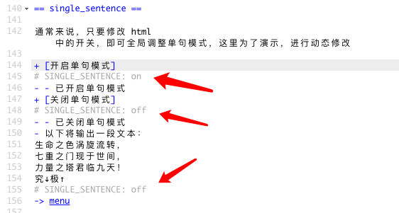

# Inky Go 使用文档

## 安装方法

[如何安装 Inky Go 模版](install.md)

## 功能说明

模版中大部分功能，均使用 Inky 的 TAG 功能实现，格式为

```
# TAG名称 : TAG内容
```

例如：


- [单句模式](intro_single_sentence.md)
- [自动样式](intro_auto_style.md)
- [背景图片控制](intro_bg_img.md)
- [嵌入图片控制](intro_image.md)
- [背景音乐控制](intro_bgm.md)
- [音效控制](intro_se.md)
- [自动重置随机数种子](intro_random.md)