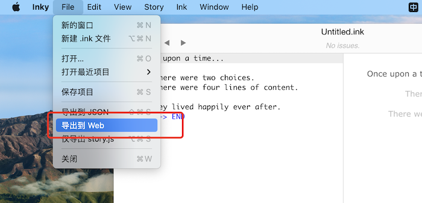
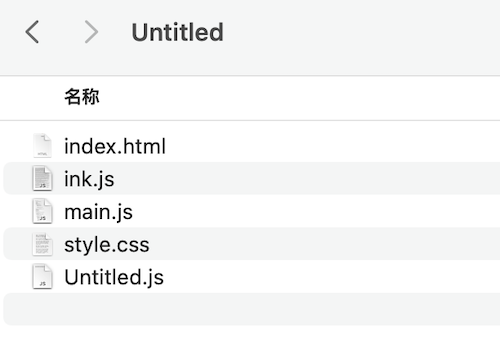
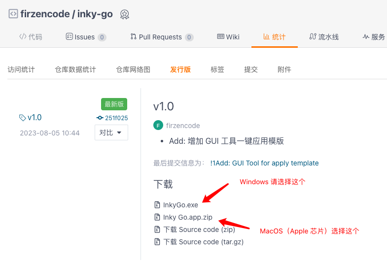
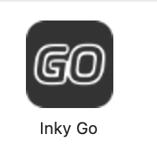
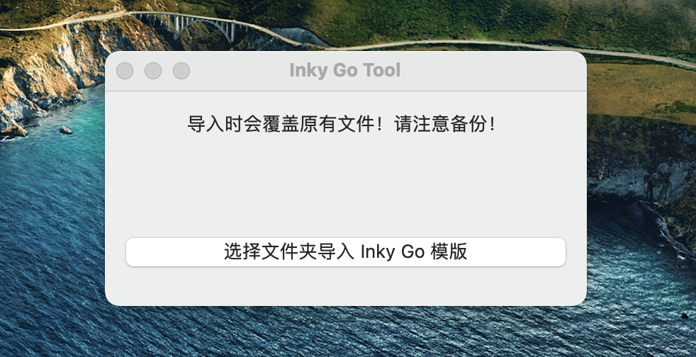
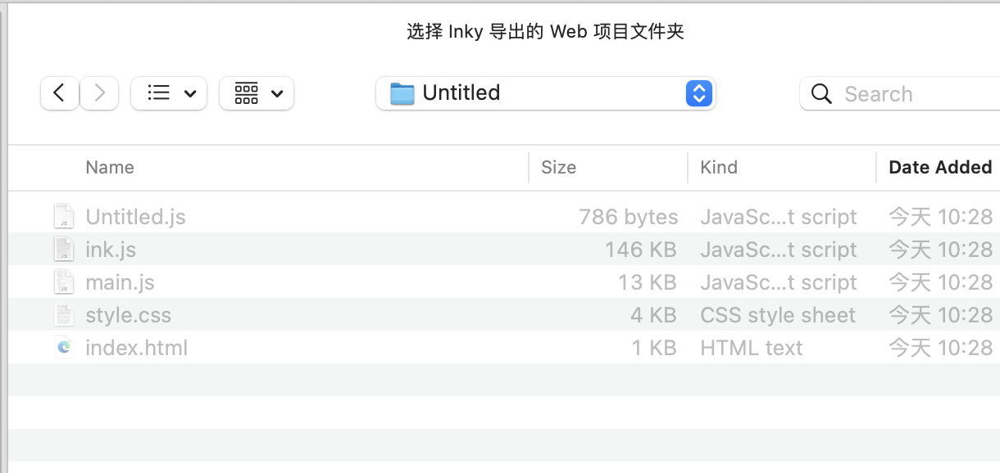
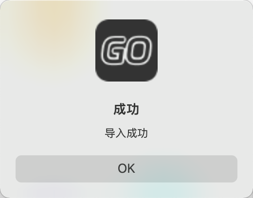

# 如何安装 Inky Go 模版

### 1. 导出 Inky Web 项目

| 步骤 | 图例 |
| -- | -- |
| 在 Inky 中，选择导出 Web 项目 |  |
| 这是一个导出后的例子 |  |

### 2. 下载 Inky Go 工具

| 步骤 | 图例 |
| -- | -- |
| 从下载页，下载最新版工具|  |
| 下载后打开工具 |  |
| 点击导入按钮 |  |
| 选择刚才导出的文件夹 |  |
| 提示导出成功 |  |

此时，Inky Go 模版已经安装成功！

### 导入工具原理说明

1. 分析原项目，找到项目 title 的内容和 story.js 的位置
2. 从 gitee 的项目主页，自动下载 index.html, main.js, style.css 三个文件
3. 替换上述三个文件后，再将 title 和 story.js 的相关内容复原