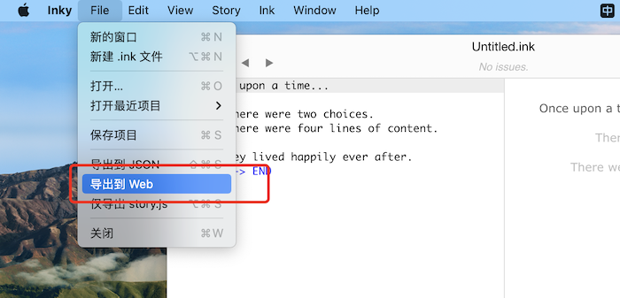
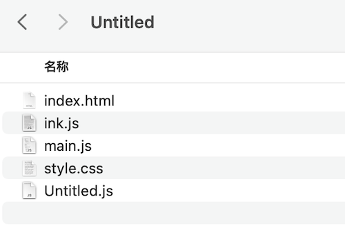
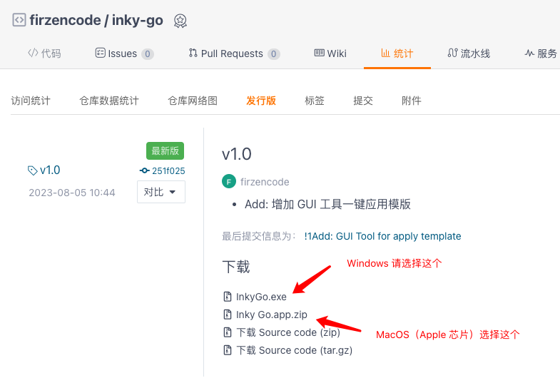
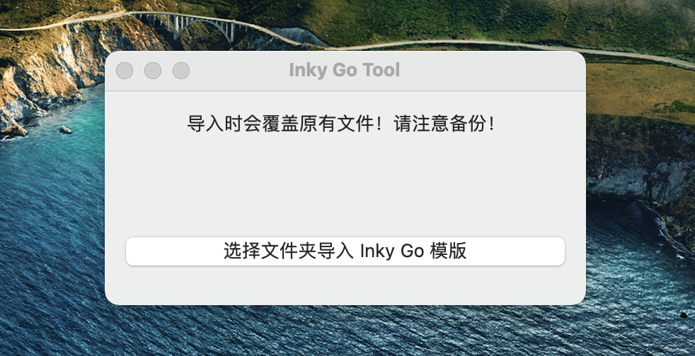
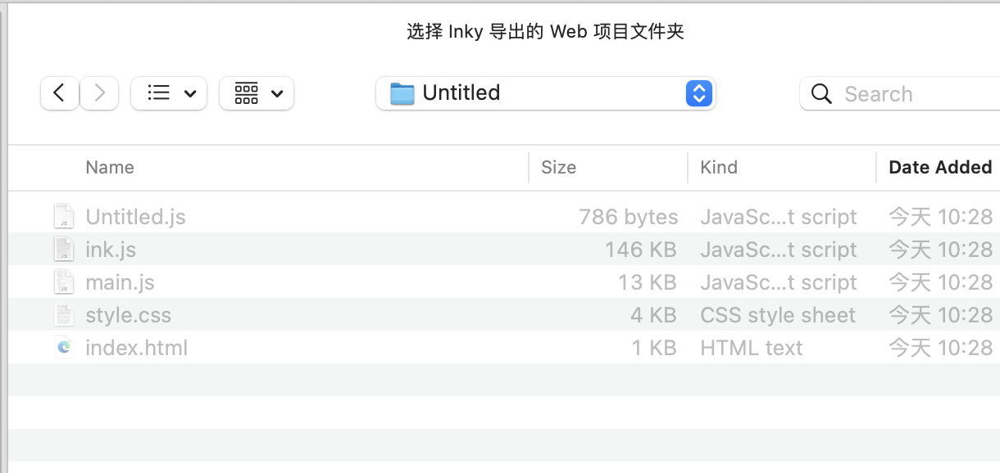

# 如何安装 Inky Go 模版

### 1. 导出 Inky Web 项目

| 步骤 | 图例 |
| -- | -- |
| 在 Inky 中，选择导出 Web 项目 |  |
| 这是一个导出后的例子 |  |

### 2. 下载 Inky Go 工具

| 步骤 | 图例 |
| -- | -- |
| 从下载页，下载最新版工具|  |
| 下载后打开工具 |  |
| 点击导入按钮 |  |
| 选择刚才导出的文件夹 |  |
| 提示导出成功 |  |

此时，Inky Go 模版已经安装成功！