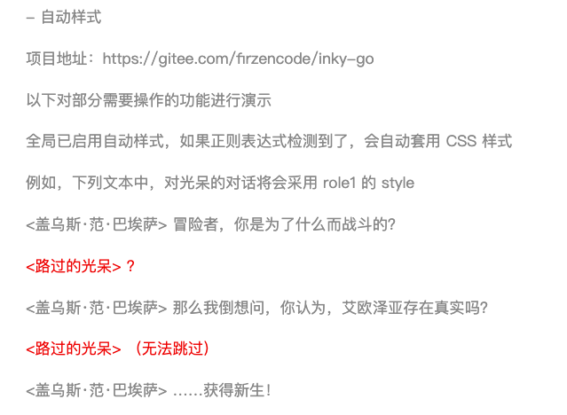

# 自动样式

通过设置自动样式，在每行文本显示之前，会进行正则表达式检查

如果搜索到了，则对该行文本赋予指定的 CSS Style

这样，就不用每行文本都增加 Inky 自带的 #CLASS 标签了



使用方法：

```
开启
# AUTO_STYLE: regex@style

例如
# AUTO_STYLE: <路过的光呆>@role1

根目录的 style.css 添加
.role1 {
    color: #ee0000   
}

```